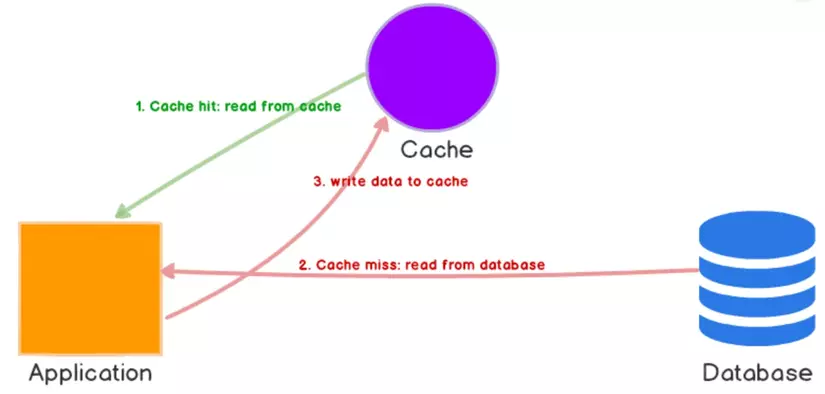
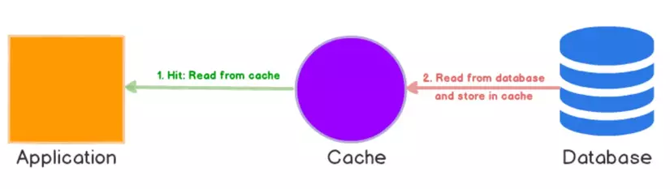
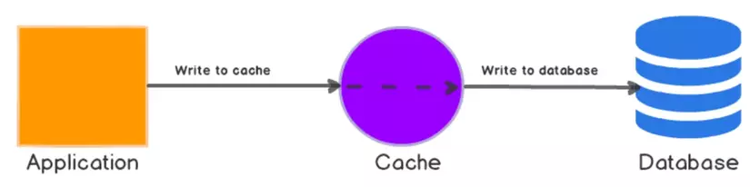
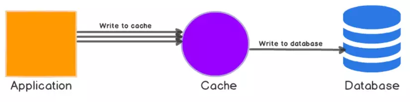
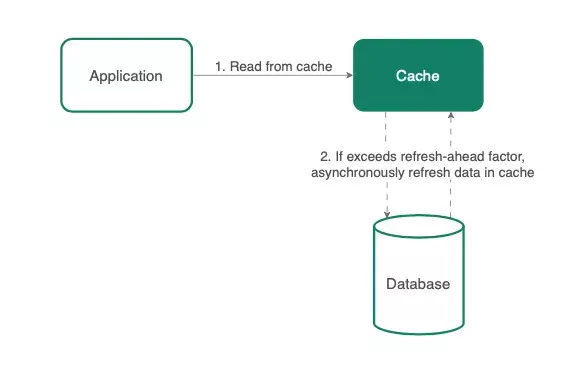

#

Giới thiệu về cache

> Mục đích chính của bộ nhớ đệm là cải thiện hiệu suất truy xuất dữ liệu bằng cách giảm thiểu lượng truy cập vào kho dữ liệu ở phía dưới. Bộ nhớ đệm giống như một hộp kho báu nhỏ giữ sẵn dữ liệu được truy cập thường xuyên nhất để bạn có thể sử dụng ngay lập tức.

## I. Một số loại cache phổ biến

#### 1. Browser Caching

> Bộ nhớ đệm trình duyệt (browser caching) lưu trữ các tài nguyên trang web trên local khi người dùng truy cập một trang web. Trong lần truy cập tiếp theo, trình duyệt sẽ tải trang từ các tài nguyên trên local, giúp giảm tải cho máy chủ và cải thiện tốc độ tải trang.

#### 2. CDN Caching

> CDN Caching sao chép dữ liệu của bạn trên khắp các vị trí địa lý khác nhau, giúp giảm thời gian di chuyển dữ liệu (độ trễ) bằng cách phục vụ nó từ máy chủ gần nhất với người dùng.

Các ông lớn cung cấp dịch vụ CDN như Cloudflare và AWS CloudFront.

#### 3. Database Query Caching

> Database Query Caching lưu trữ kết quả của một truy vấn trong bộ nhớ đệm. Khi cùng một truy vấn được thực thi, hệ thống quản lý cơ sở dữ liệu (DBMS) sẽ kiểm tra bộ nhớ đệm trước. Nếu tìm thấy, kết quả sẽ được trả về từ bộ nhớ đệm, bỏ qua việc truy cập vào cơ sở dữ liệu.

- Có các giải pháp dành riêng cho cơ sở dữ liệu, chẳng hạn như MySQL Query Cache, hoặc cũng có thể sử dụng ORM có bao gồm cache, chẳng hạn như Hibernate cho Java.

#### 4. In-Memory Caching

> In-memory caches lưu trữ dữ liệu trong RAM, nhanh hơn nhiều so với bộ lưu trữ trên đĩa. Chúng thường được sử dụng cho dữ liệu đọc thường xuyên và ít thay đổi.

#### 5. Application Caching

> Application Caching cho phép ứng dụng lưu trữ các thể hiện hoặc dữ liệu cần tốn kém tài nguyên để tạo.

- Bộ nhớ đệm này có thể được xây dựng riêng cho ứng dụng hoặc được xử lý bởi một tính năng của framework như Spring Cache cho các ứng dụng Java.

#### 6. Distributed Caching

> Distributed cache là một bộ nhớ đệm được chia sẻ trên nhiều máy chủ, thường được sử dụng trong kiến trúc Microservices. Nó cải thiện hiệu suất và khả năng mở rộng bằng cách sao chép dữ liệu cache trên các nodes trong hệ thống. Các công cụ như Redis, Memcached và Hazelcast là những lựa chọn phổ biến.

## II. Cơ chế của cache: Cache hit, Cache miss và Cache eviction policies

#### 1. Cache Hit

> Cache hit mô tả tình huống nội dung được lấy thành công từ bộ nhớ đệm. Hệ thống sẽ nhanh chóng tìm kiếm trong bộ nhớ, và nếu dữ liệu được tìm thấy nó tiến hành đọc dữ liệu, đó được gọi là một cache hit.

#### 2. Cache Miss

> Lượt truy cập cache thất bại đề cập đến trường hợp hệ thống tìm kiếm dữ liệu trong bộ nhớ đệm nhưng không tìm thấy. Khi điều này xảy ra, nội dung mới sẽ được ghi vào bộ nhớ đệm để phục vụ tìm kiếm trong cache cho những lần sau.

#### 3. Cache eviction policies

- Bộ nhớ của cache là hữu hạn. Việc dữ liệu tồn đọng trong cache cần phải xóa đi là thường xuyên xảy ra, do đó ta cần có các chiến lược xóa dữ liệu không còn cần thiết từ Cache.
- Dưới đây là một vài cơ chế thường được sử dụng để dọn dẹp dữ liệu thừa trong cache:

  - First In First Out (FIFO): Các dữ liệu được ghi vào Cache trước thì sẽ được ưu tiên xóa đi trước mà không quan tâm tới tần suất hay số lượng truy cập của nó.
  - Last In First Out (LIFO): Sẽ ưu tiên xóa những dữ liệu được ghi cũ nhất mà không quan tâm tới tần suất hay số lượng truy cập của nó.
  - Least Recently Used (LRU): Sẽ xóa những dữ liệu ít được truy cập gần đây.
  - Most Recently Used (MRU): Sẽ xóa những dữ liệu được truy cập thường xuyên gần đây.
  - Least Frequently Used (LFU): Sẽ xóa những dữ liệu ít được truy cập nhất.
  - RR: Sẽ trọn ra một dữ liệu bất kỳ trên Cache để thực hiện thao tác xóa
- Thông thường thì hệ thống sẽ đánh dấu thời điểm hết hạn (expire time) của dữ liệu, nếu quá thời gian đó thì Cache sẽ bị xóa đi. Việc tính toán cache là một vấn đề khá đau đầu tùy thuộc vào logic của hệ thống đang được phát triển.

## III. Các Chiến Lược Cache

Một bộ nhớ đệm được triển khai tốt có thể tăng tốc đáng kể hiệu suất của ứng dụng. Tuy nhiên, hiệu quả của việc bộ nhớ đệm bị ảnh hưởng đáng kể bởi chiến lược mà nó được áp dụng. Cùng xem qua một vài chiến lược caching và thời điểm nên sử dụng chúng.

#### 1. Cache-Aside (Lazy Loading)

- Trong chiến lược Cache-Aside, ứng dụng sẽ tìm kiếm dữ liệu trong bộ nhớ đệm trước. Nếu không tìm thấy dữ liệu (cache miss), nó sẽ tải dữ liệu từ nguồn, lưu trữ trong bộ nhớ đệm và sau đó trả về. Chiến lược này đảm bảo rằng chỉ dữ liệu được yêu cầu mới được lưu trữ, do đó ngăn chặn việc lưu trữ dữ liệu không cần thiết.
- Chiến lược này phù hợp nhất khi các lần read xảy ra thường xuyên hơn nhiều so với các lần write và dữ liệu ít được cập nhật.
- 

Ví dụ:

Một ứng dụng mạng xã hội như Facebook. Nếu người dùng muốn xem danh sách bạn bè của mình, ứng dụng đầu tiên tìm kiếm nó trong bộ nhớ đệm. Nếu không tìm thấy (cache miss), ứng dụng sẽ truy vấn cơ sở dữ liệu, lưu trữ kết quả trong bộ nhớ đệm và sau đó trả về danh sách bạn bè cho người dùng.

#### 2. Read-Through (Eager Loading)

- Trong chiến lược Read-Through, bộ nhớ đệm hoàn toàn tách biệt khỏi ứng dụng. Khi xảy ra lượt truy cập cache thất bại (cache miss), chính bộ nhớ đệm sẽ chịu trách nhiệm đọc dữ liệu từ nguồn dữ liệu, lưu trữ và sau đó trả về. Cách tiếp cận này duy trì tính nhất quán của dữ liệu và giúp ứng dụng không cần tương tác với nguồn dữ liệu.
- Chiến lược này hoạt động tốt nhất khi chi phí của một lượt cache miss là đắt đỏ và khi bạn muốn logic của ứng dụng của mình đơn giản.
  

**Ví dụ:**

Một trang thương mại điện tử như Amazon. Khi bạn tìm kiếm sản phẩm, bộ nhớ đệm sẽ ngắt yêu cầu. Nếu không tìm thấy sản phẩm (cache miss), chính bộ nhớ đệm sẽ truy vấn cơ sở dữ liệu, lưu trữ kết quả và sau đó trả lại thông tin sản phẩm cho bạn.

#### 3. Write-Through
- Trong chiến lược Write-Through, mọi hoạt động ghi vào cơ sở dữ liệu đồng thời được ghi vào bộ nhớ đệm. Điều này đảm bảo bộ nhớ đệm luôn chứa dữ liệu mới nhất, giảm thiểu việc có chứa dữ liệu cũ ở trong cache.

- Chiến lược này phù hợp khi các hoạt động write ít thường xuyên hơn và cần dữ liệu cập nhật trong bộ nhớ đệm mọi lúc.
    

Ví dụ:

Hãy tưởng tượng một nền tảng blog. Mỗi khi người dùng đăng bài blog mới, ứng dụng sẽ đồng thời ghi blog vào cơ sở dữ liệu và bộ nhớ đệm, đảm bảo các bài blog mới nhất luôn có sẵn trong bộ nhớ đệm.

#### 4. Write-Back (Write-Behind)
- Trong chiến lược Write-Back, các hoạt động ghi đầu tiên được ghi vào bộ nhớ đệm và sau đó bộ nhớ đệm sẽ ghi dữ liệu lại vào cơ sở dữ liệu sau một khoảng thời gian nhất định. Chiến lược này giúp giảm đáng kể tải trọng cho cơ sở dữ liệu.

- Chiến lược này lý tưởng khi hiệu suất write quan trọng hơn tính nhất quán của dữ liệu và nguy cơ mất dữ liệu có thể chấp nhận được.

    

Ví dụ:

Xem xét chức năng "thích" trên một trang mạng xã hội. Hành động thích bài đăng đầu tiên được ghi vào bộ nhớ đệm. Sau đó, bộ nhớ đệm cập nhật cơ sở dữ liệu sau một khoảng thời gian, có thể là gom nhiều lượt "thích" rồi mới cập nhật vào bên trong cơ sở dữ liệu. Điều này giúp giảm đáng kể hoạt động của cơ sở dữ liệu.

#### 5. Refresh-Ahead
- Trong chiến lược Refresh-Ahead, bộ nhớ đệm chủ động làm mới dữ liệu trước khi nó cũ đi hoặc hết hạn. Chiến lược này đảm bảo dữ liệu luôn sẵn sàng trong bộ nhớ đệm, giảm thiểu độ trễ của cache miss.

- Chiến lược này phù hợp khi ta có thể dự đoạn được người dùng sẽ truy vấn dữ liệu nào và thời điểm truy vấn. Chiến lược này có thể tốn thêm tài nguyên vì ứng dụng cần chủ động tải trước dữ liệu trước khi nó được yêu cầu. Bạn cần đảm bảo hệ thống có đủ khả năng xử lý lượng dữ liệu được tải trước để tránh ảnh hưởng đến hiệu suất tổng thể.

    

Ví dụ:

Ứng dụng thời tiết cần hiển thị cập nhật thời tiết theo giờ. Ứng dụng có thể sử dụng chiến lược Refresh-Ahead để tải trước dữ liệu thời tiết của giờ tiếp theo trước khi dữ liệu của giờ hiện tại hết hạn. Điều này đảm bảo người dùng luôn nhận được thông tin thời tiết cập nhật ngay lập tức.