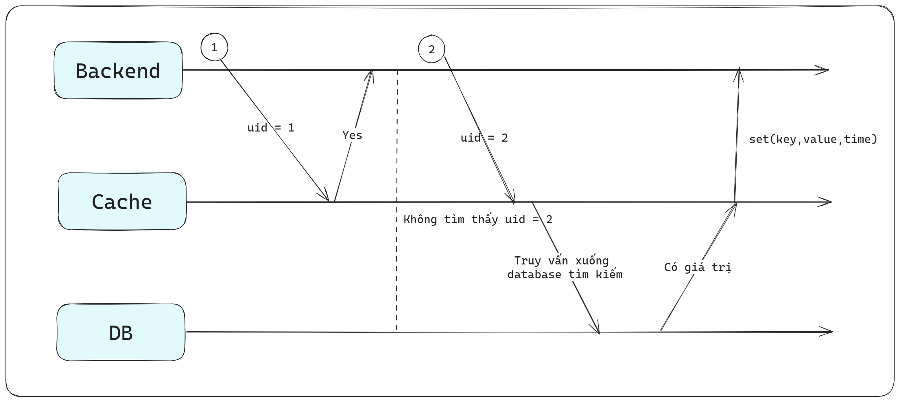
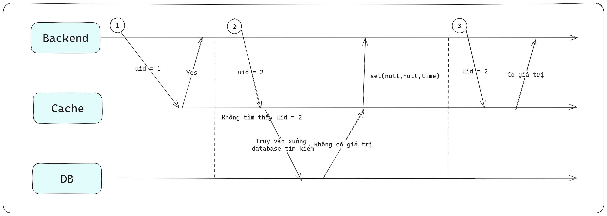

# Các giải pháp của Redis (bao gồm Cache)

## 1. Backend xử lý 100tr request mỗi phút

- Scenario của giải pháp như sau
  - Nếu trên backend gửi xuống muốn lấy thông tin sản phẩm với uid = 1, nếu đang có ở trong cache r thì ta sẽ trả về ngay lập tức giá trị trong cache
  - Nếu backend gửi xuống muốn lấy thông tin sản phẩm với uid = 2, nếu giá trị không có trong cache thì ta sẽ phải xuống database lấy thông tin giá trị với uid = 2 đó
  - Sau khi lấy được thông tin giá trị uid = 2 từ databse, ta sẽ gán giá trị lấy được đó lên cache để thực hiện cho các request sau. Giá trị `time` của giá trị uid trong cache nên để phù hợp với nghiệP vụ của từng công ty (Ví dụ: với những công ty có giá trị uid liên tục thay đổi thì ta cần phải set giá trị time thật nhỏ cho việc query liên tục để tránh sai lệch dữ liệu)

Với trường hợp trên nghe có vẻ đơn giản, nhưng trường hợp với 100 triệu request nếu uid = 2 không có cả trong cache lẫn database thì ta sẽ phải xử lý như thế nào?
=> Lúc này ta sẽ phải thay đổi cơ chế lưu cache một chút 

- So với kịch bản ở phía trên:
  - Nếu như trong database không có chứa giá trị uid = 2, để tránh trường hợp 100 triệU người cùng query tới dữ liệu uid = 2 => sẽ liên tục query vào database do không tìm thấy trong cache => làm áp lực lên hệ thống database
  - Vì vậy, khi query tới database lần đầu, nếu không tìm thấy giá trị, ta phải quay lại set giá trị trong cache một giá trị là `null` và giá trị time tuỳ vào nghiệp vụ
  - Các lần query sau đó nó sẽ query tới cache và khi thấy giá trị là null nó sẽ vẫn trả về cho phía backend