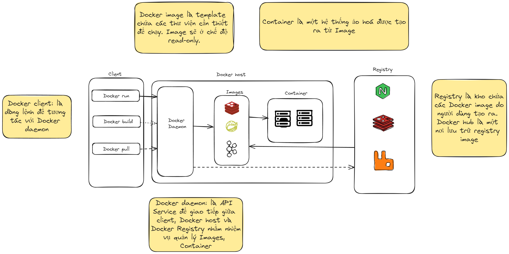

# Docker Architecture

## 1. Tổng quan

- Docker desktop là ứng dụng all-in-one trên máy tính. Dễ dàng cài đặt Docker client và Docker daemon. Sau khi cài đặt có thể sử dụng cả CLI(dòng lệnh) và GUI(giao diện đồ hoạ). Docker host là máy chủ để chạy các container

## 2. Cách hoạt động

## 2.1. Docker Image

- Vì sao lại gọi là Image?  

> Đơn giản vì ta tưởng tượng khi chụp một bức ảnh. Bức ảnh đó được hình thành tự một tập các layers chồng chéo lên nhau. Docker Image cũng vậy, nó là tập hợp của các ứng dụng, HDH, ... xếp chồng lên nhau tạo thành 1 image lớn

- Khi chạy `run`, `build` nó sẽ ghép chồng tất cả các layer thành một hình ảnh hoàn chỉnh (container) để người dùng có thể sử dụng và chạy được

## 2.2. Docker Image Layer

