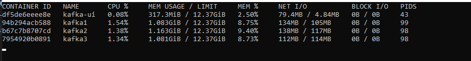

# Chuyện gì sẽ xảy ra nếu chạy container

- Khi sử dụng câu lệnh 'docker container run' trước hết
  - Kiểm tra trong image đã tải xuống đã có image cần tải chưa
  - Nếu chưa có nó sẽ tìm kiếm image trên remote repository (docker hub)
  - Sau đó nó sẽ tải xuống image về local từ remote
  - Tạo một container với image vừa tải xuống để chuẩn bị start
  - Cấp cho nó một IP ảo trong mạng private bên trong docker engine
  - Mở một port 80 trên máy host và forward port đó tới port 80 của container

# Câu lệnh kiểm tra container

- `docker container stats`: kiểm tra thông số về CPU, memory,... của từng container đang hoạt động như thế nào

- `docker container inspect`: xem thông tin chi tiết về container (mạng, ip, đường dẫn bộ nhớ,...)

- `docker container top`: log ra tất cả các process đang chạy bên trong container

# Câu lệnh kiểm tra bên trong container

- `docker container run -it`: khởi tạo mới một container 

- `docker container exec -it`: vì container được coi như là một VM, nên câu lệnh này sẽ mở bash của container đấy