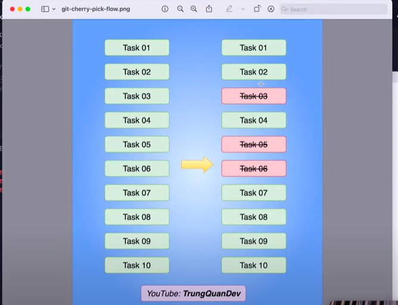

# Git Cherry Pick

Trong 1 dự án, ta có rất nhiều nhánh *release*, *develop*, *UAT*, .... và khi mà đẩy lên build bản release, có rất nhiều feature mà ta không muốn đưa lên trong lần build lần này, nhưng code đã được có trên nhánh UAT chẳng hạn, thì *cherry-pick* sẽ giúp ta pick được những commit mà ta muốn đẩy vào nhánh *release* để build lên lần này

Cách giải quyết:

Trước hết ta phải log ra được các commit của nhánh:
- git log --oneline --no-merges

Sau đó ta tạo một branch mới mà nhánh đó chính là nhánh ta deploy lên prod
- git checkout <name_deploy>

Giả sử như hình ở trên, ta muốn bỏ đi task 03 thì ta cần checkout về task 02: (ta có thể vừa tạo vừa pick commit luôn như ví dụ dưới). Lúc này nhánh mới sẽ bao gồm cả *Task 01* và *Task 02*
- git checkout -b deploy_prod <hash-commit>

Sau đó, ta sẽ cherry pick những commit còn lại muốn pick ở trong nhánh:
- git cherry-pick <hash-commit>
  

