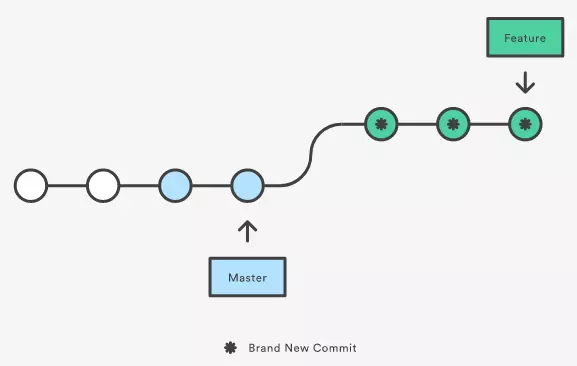
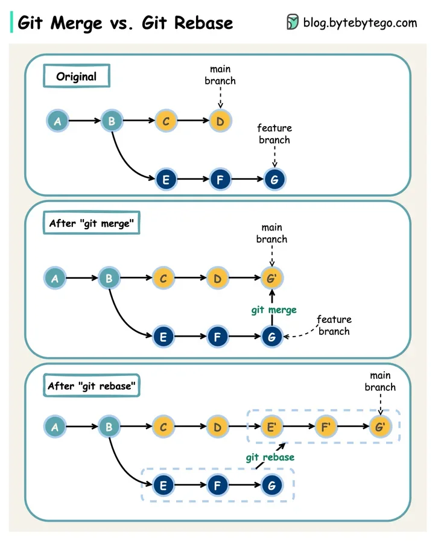
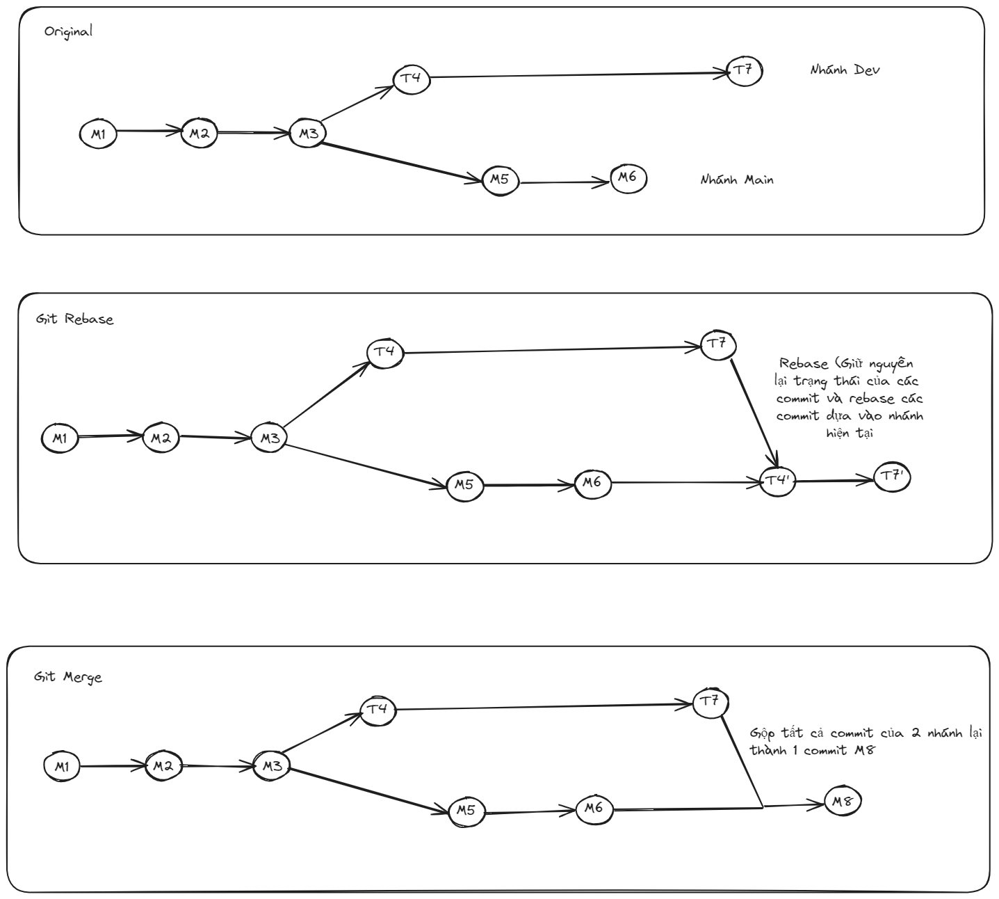

# Git Merge và Git Rebase

- Git Merge và Git Rebase đều có mục đích kết hợp code giữa các nhánh với nhau

## 1. Git Merge

- Ví dụ trong trường gộp giữa nhánh `feature` vào nhánh `main`, ta thực hiện như sau:
  - git checkout feature
  - git merge main
    => Kết quả: tạo ra một commit mới ngay trên nhánh `main`, commit này gắn kết lịch sử của cả 2 nhánh `main` và `feature`


## 2. Git Rebase

- Còn 1 cách khác để tích hợp là sử dụng `rebase`
  - git checkout feature
  - git rebase master

=> Đưa toàn bộ những commit mới tạo ở nhánh `feature` nối tiếp vào ngọn của nhánh `master`, nó sẽ viết lại lịch sử của project bằng cách tạo ra những commit mới tương ứng với mỗi commit ban đầu của nhánh `feature`



- Lợi ích của `rebase` so với `merge` là bạn sẽ nhận được 1 lịch sử commit rõ ràng, dễ theo dõi hơn (loại bỏ những commit không cần thiết khi sử dụng `git merge`)

### a - Quy trình làm việc với git rebase

- Vì rebase có thể gây ra xung đột giữa các commit lẫn nhau và có những commit rác => Vì vậy phải sử dụng git rebase một cách đúng

#### a.1 - Local cleanup

- Trong quá trình phát triển một tính năng trên branch riêng, các dev có thể có nhiều commit => Để cây git được clean và gọn hơn ta phải tiến hành squash commit thông qua tính năng tự rebase trên nhánh chính `feature`
- Ví dụ bạn có 3 commit liên tục cần gộp lại thành 1 commit:

```
git switch feature
git rebase -i HEAD~3 (Cho phép ta có thể lựa chọn commit muốn bỏ, hoặc gộp các commit ở dưới thành 1 commit chung nhưng k nên sử dụng cách này mà nên sử dụng chery pick)
```

Màn hình hiển thị một tệp editor hiển thị lịch sử commits, chúng ta tiến hành cỉnh sửa file theo syntax. Các options bao gồm:

- p: pick - giữ lại commit
- r: reword - giữ lại commit và sửa message
- s: squash - bỏ qua commit nhưng tích hợp log vào commit liền trước
- f: fixup - bỏ qua commit và xoá hoàn toàn log commit

```
pick 1fc6c95 Patch A
pick 6b2481b Patch B
pick dd1475d something I want to split
pick c619268 A fix for Patch B
pick fa39187 something to add to patch A
pick 4ca2acc i cant' typ goods
pick 7b36971 something to move before patch B

# Rebase 41a72e6..7b36971 onto 41a72e6
#
# Commands:
#  p, pick = use commit
#  r, reword = use commit, but edit the commit message
#  e, edit = use commit, but stop for amending
#  s, squash = use commit, but meld into previous commit
#  f, fixup = like "squash", but discard this commit's log message
#  x, exec = run command (the rest of the line) using shell
#
# If you remove a line here THAT COMMIT WILL BE LOST.
# However, if you remove everything, the rebase will be aborted.
#
```

Tiến hành giữ lại commit đầu tiền và squash toàn bộ các commits liền sau bằng cách thay thế pick thành squash. Lưu file :wq và thoát qa!.

#### a.2 - Rebasing from main

- Tiếp theo, sau khi đã gom tất cả các commit của mình làm một chúng ta bắt đầu tiến hành rebase so với branch main. Lưu ý, trước đó ta cần nhảy sang nhánh main và tiến hành pull code từ remote để cập nhật các thay đổi mới nhất trên main.

```
git switch main
git pull origin main
git switch feature
git rebase -i main feature
```

#### a.4 - Push force to feature

- Sau khi đã xử lý các conflicts liên quan và squash các commit mong muốn, lúc này các commits trên main đã được cắt nối tuyến tính vào ngay đầu commit trên feature . Khi đó, chúng ta sẵn sàng push lên remote và sẵn sàng tạo Merge/Pull request

```
git push origin feature --force 
```

Sau khi rebase, lịch sử commit local trên nhánh feature đã thay đổi và conflict so với nhánh feature trên remote, vì thế ta cần push force để ghi đè toàn bộ cây Git trên branch featue.

## 3. So sánh Git Rebase và git merge





