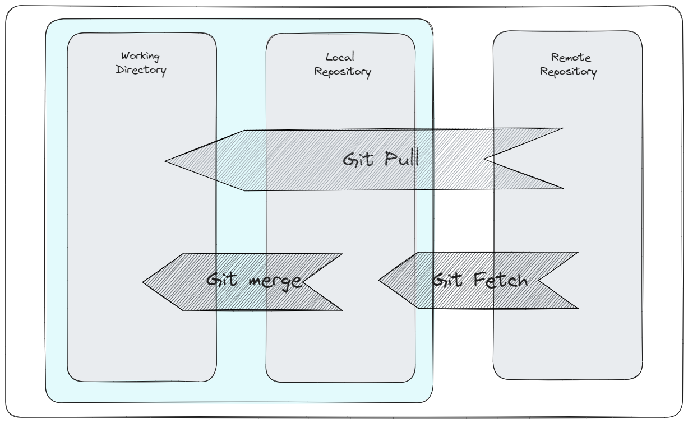

# So sánh sự khác nhau giữa pull và fetch

Về cơ bản *Git pull = Git Fetch + Git merge*, nghĩa là
- Với **git pull** khi sử dụng nó sẽ down sự thay đổi trực tiếp từ remote repository (Repository trên git) về trực tiếp working directory (project đang code trên máy chưa được commit lên Local Repository)
- Còn với **git fetch** khi sử dụng nó sẽ chỉ down sự thay đổi từ Remote Repository (Repository trên git) về Local Repository (Project cũng nằm trên máy nhưng đã được quản lý version bởi Git). Sau đó ta phải dùng **git merge** để code working directory được đồng bộ với remote repository
  
=> *Git fetch* có thể được coi là phiên bản an toàn hơn của *git pull*. Khi sử dụng git fetch sẽ tải xuống remote content mà không cập nhật trạng thái hoạt động của local repository từ đó nội dung code không bị ảnh hưởng. Ngược lại, git pull sẽ tải xuống remote content và ngay lập tức thực hiện *git merge* để merge commit cho remote content mới (Nếu đang có các thay đổi đang chờ xử lý, điều này có thể khiến local repository vào trạng thái xung đột)
