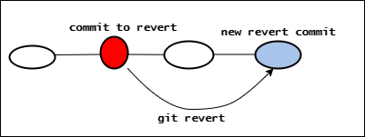

# Git Reset And Git Revert

- Git reset và git revert đều là các cách cơ bản để huỷ thay đổi trong git

## 1. Git reset

- Git reset chuyển tham chiếu của nhánh hiện tại lên commit cũ hơn. Git reset sẽ dịch chuyển nhánh lên trên như thể các nhánh sau commit revert chưa từng được tạo ra

```
    Git reset --soft <commit>: trở lại commit muốn trở về và các commit sau commit trở về sẽ được lưu lại ở stage
    Git reset --mixed <commit>
    Git reset --hard <commit>: trở lại commit muốn trở về và các commit sau commit sẽ bị xoá đi hết

```

`Chú ý: sau khi reset, vì nó chỉ thay đổi trên local nên nếu push lên trên remote sẽ bị config => ta cần phải ép buộc nhánh trên remote giống với bên local (nhưng không nên sử dụng) bằng cách sử dụng -f (git push -f origin)`

Links: https://git-school.github.io/visualizing-git/#free-remote

## 2. Git Revert
- Git revert cũng sẽ hoạt động đưa `HEAD` hiện tại về commit trước đó nhưng sẽ vẫn giữ cả các commit sau đó như cũ (vì reset trên local thì rất dễ nhưng khi đã đưa lên remote rồi thì rất khó để reset được như local => Để mọi người trên local có thể thấy được ta muốn đưa `HEAD` về trước đó => Sử dụng git revert)

`Chú ý: khác với reset sẽ đưa bạn về commit cần tới, git revert sẽ tạo thêm 1 commit giống với commit b muốn revert và thêm vào sau commit hiện tại HEAD đang trỏ tới`




