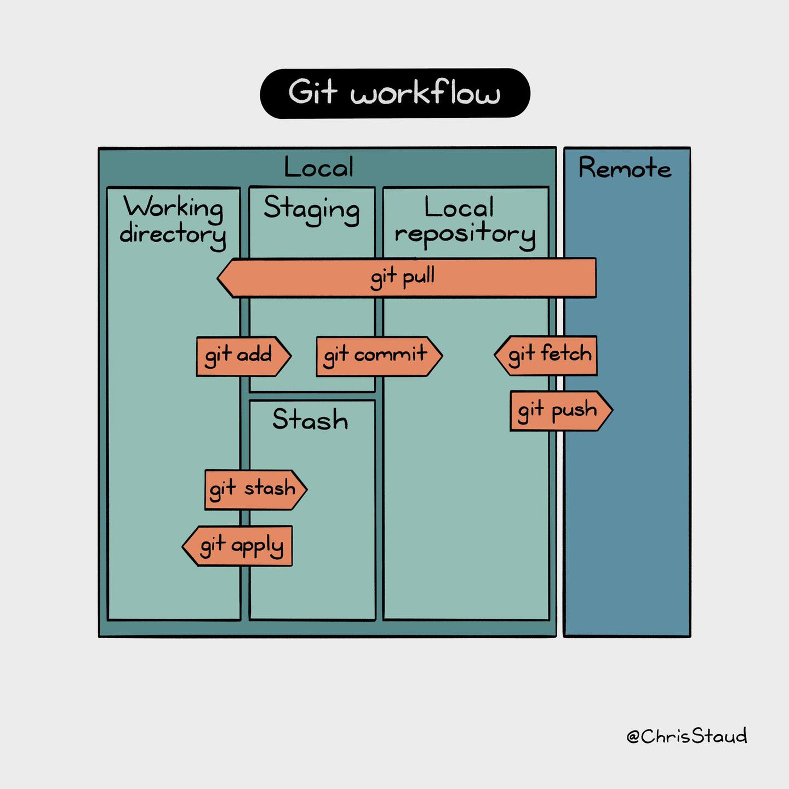

# TrickGit 


## Git stash 
Trường hợp 1: Giả sử khi bạn đang code hoặc sửa trên một branch, mà trên nhánh *master* có một dev khác đã push và merge code vào nhánh master. Lúc này, nhánh master sẽ là một phiên bản mới nhất mà code ở working directory chưa có, mà ta thì muốn sử dụng code đó cho việc code nhánh hiện tại của mình. Nhưng để pull được code đó về ta phải commit các file thay đổi trên nhánh hiện tại. Dựa vào đó, ta có thể sử dụng *git stash* để lưu lại code (giống như việc commit code vào stash chứ k đẩy commit file lên local repository)



Cú pháp thường dùng:
```
    git stash save <name> : lưu lại code trên stash 
    git stash list: lấy ra danh sách các commit đã lưu trên stash
    git stash apply <code_stash>: rollback lại commit đã lưu trên stash vào working directory
```

## Git ammend

Trường hợp khi bạn muốn sửa một commit ngay trước đó (có thể là sửa message commit, up thêm file commit, xoá file commit,....), ta nên thêm, sửa, .. ngay trên commit trước đó. *Git ammend* sẽ cho phép ta sửa commit trước đó

Cú pháp:
```
    git commit --amend (có thể trước đó ta phải git add những file muốn sửa vào commit ngay liền trước)
    git commit --amend -m "<message>" : sửa message commit liền ngay trước
```

Sau khi *git commit --amend*, nếu trên remote đã được tạo pull request, thì ta phải sử dụng câu lệnh *git push -f* (vì trước đó đã có pull request với commit đó rồi mà để push được commit đã sửa lại lên ta phải sử dụng câu lệnh này). Còn nếu ngược lại, nếu chưa có pull request trên remote, ta chỉ cần dùng câu lệnh *git push* là xong

## 
