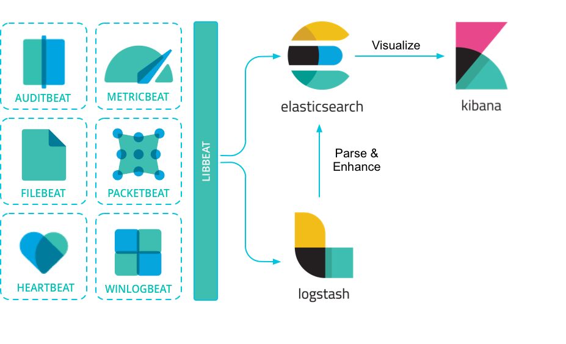

# Giới thiệu về Beats

> Beat được coi là một data shipper. Khi cài đặt beat sẽ như là một người quản lý server sẽ gửi tập các dữ liệu data đến cho `ElasticSearch`

> Beats có thể gửi data trực tiếp đến `ElasticSearch` hoặc thông qua `LogStash` xử lý rồi mới gửi tới ElasticSearch

## 1. Các loại Beats

- Với mỗi cấu hình riêng sẽ bao gồm rất nhiều loại beats, nhưng chủ yếu các loại beats này sẽ đều được khởi tạo từ `libbeat framework`
  - [Filebeat](File-beat.md): Filebeat là một beat được sử dụng để thu nhập và chuyển dữ liệu từ các tập tin log. Nó theo dõi các tập tin log và gửi các sự kiện log đến Logstash hoặc Elasticsearch để xử lý và lưu trữ.
  - Metricbeat: Metricbeat được sử dụng để thu thập thông tin về các chỉ số hệ thống và dịch vụ từ các máy chủ và hệ thống. Nó có thể thu thập các chỉ số CPU, bộ nhớ, tải hệ thống, thông tin về dịch vụ như MySQL, Apache và nhiều hơn nữa. Metricbeat gửi các dữ liệu thu thập được đến Logstash hoặc Elasticsearch để phân tích và hiển thị.
  - Packetbeat: Packetbeat là một Beat được sử dụng để thu thập thông tin về giao thức mạng từ dữ liệu gói tin. Nó có thể phân tích và hiểu được các giao thức như HTTP, DNS, ICMP, MySQL, PostgreSQL và nhiều giao thức khác. Packetbeat gửi dữ liệu thu thập được đến Logstash hoặc Elasticsearch để phân tích và xem xét chi tiết về hoạt động mạng.
  - Auditbeat: Auditbeat là một Beat được sử dụng để thu thập các sự kiện hệ thống và log kiểm tra an ninh từ các hệ điều hành Linux. Nó có thể thu thập thông tin về hoạt động hệ thống như các sự kiện đăng nhập, thay đổi quyền truy cập file, các sự kiện quản lý quyền truy cập và nhiều hơn nữa. Auditbeat gửi dữ liệu thu thập được đến Logstash hoặc Elasticsearch để phân tích và giám sát an ninh hệ thống.
  - Heartbeat: Heartbeat là một Beat được sử dụng để theo dõi sự hoạt động và sự sống còn của các dịch vụ và máy chủ. Nó có thể kiểm tra kết nối mạng, kiểm tra tính khả dụng của dịch vụ web và nhiều kiểm tra khác. Heartbeat gửi thông tin về trạng thái hoạt động đến Logstash hoặc Elasticsearch để giám sát và thông báo sự cố.
  - WinlogBeat: gửi dữ liệu log của Windows tới ElasticSearch hoặc LogStash. Các dữ liệu log sẽ bao gồm: application events, hardware events, security events, system events
  - FunctionBeat

<!-- ## 2. Tìm hiểu sâu về các beats

### 2.1. FileBeat

[Filebeat about](File-beat.md) -->