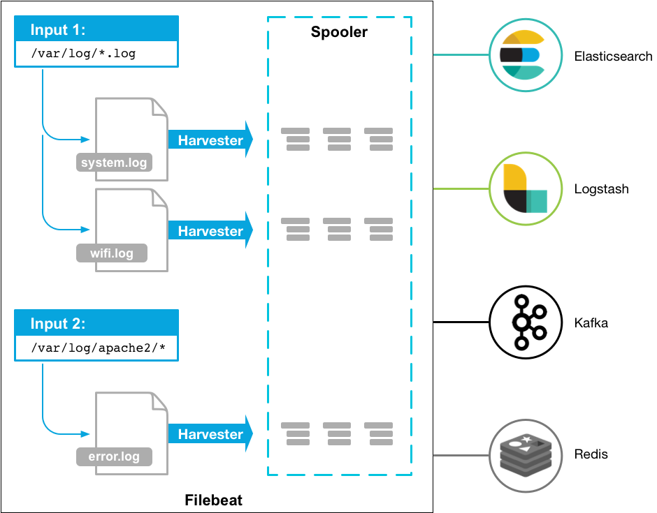

# Giới thiệu về FileBeat

## Tổng quan

> Filebeat gửi và quản lý tập trung các log data. Khi cài đặt Filebeat như một người quản lý cho server, Filebeat sẽ giám sát các tệp nhập ký do bạn chỉ định, giám sát các log events và gửi log đó tới `ElasticSearch` hoặc `LogStash`

> Cách hoạt động của Filebeat: Khi chạy Filebeat, nó sẽ bắt đầu giám sát nơi mà bạn đã config để theo dõi log data. Với mỗi file log mà Filebeat định vị, Filebeat sẽ khởi tạo một trình thu thập gửi data tới libbeat - nơi tổng hợp các sự kiện và gửi dữ liệu tổng hợp đến đầu ra mà bạn đã cấu hình cho Filebeat




- Filebeat bao gồm 2 thành phần chính: `inputs` và `harvesters` (thu thập)
### Harvesters

`Harvesters` chịu trách nhiệm đọc content của file. Việc thu thập này sẽ qua từng file, từng dòng và gửi dữ liệu đến cho `output`
- Một `Harverters` được khởi tạo cho từng file
- Nếu file bị sửa tên hoặc bị xoá đi trong lúc `Beat` đang thu thập, Filebeat sẽ tiếp tục đọc file (điều này có thể sẽ lock lại bộ nhớ đang sử dụng cho tới khi quá trình thu thập được đóng lại)
- Ngược lại, nếu file được xoá hoặc đổi tên khi tiến trình thu thập (harvester) đóng, quá trình thu thập sẽ dừng lại
- Mặc định, Filebeat sẽ giữ file được mở cho tới khi `close_inactive` là true
  

### Input

Input chịu trách nhiệm quản lý các tiến trình and tìm tất cả các nguồn để đọc dữ liệu
- Nếu input type là `log`, input sẽ tìm tất cả các file log trong ổ đĩa khớp với đường dẫn đã cho và khởi động 1 trình thu thập log cho mỗi tệp
- Ví dụ
```
filebeat.inputs:
- type: log
  paths:
    - /var/log/*.log
    - /var/path2/*.log
```

- Các định dạng input type hiện đang được hỗ trợ: [Input type filebeat](https://www.elastic.co/guide/en/beats/filebeat/current/configuration-filebeat-options.html#filebeat-input-types)


## Filebeat lưu lại trạng thái của file như thế nào?

- Filebeat sẽ thường xuyên lưu lại trạng thái đọc của từng file (lưu lại vị trí đã đọc đến của từng file) trong file `registry`
  - `Registry file` là nơi lưu trữ thông tin về mỗi file log đã được xử lý (các vị trí last offset của các Filebeat, đường dẫn của file) => Điều này giúp Filebeat biết được nó cần bắt đầu đọc từ đâu khi tiếp tục xử lý sau khi khởi động lại hoặc khi file log được cập nhật với dữ liệU mới. File Registry thường lưu trữ dưới dạng file JSON trên đĩa, vị trí mặc dịnh của file registry là `data/registry` trong thư mục gốc của Filebet.
  - Khi Filebeat được khởi động lại, nó cũng sẽ dựa vào file Registry này mà biết được sẽ tiếp tục đọc từ vị trí nào
- Nếu ElastichSearch hoặc Logstash bị lỗi không thể gửi log đến, Filebeat vẫn sẽ lưu `last offset` vào file registry và tiếp tục đọc cho tới khi Logstash hoặc ElasticSearch được khởi động lại
- Trong quá trình đọc, nếu tên file bị đổi hoặc bị chuyển đi, khi đọc lại nó sẽ đọc lại từ đầu => Để tránh việc này ngoài lưu đường dẫn và tên file thì ta còn định danh cho từng file để sau đó có thể đọc tiếp. Cơ chế định danh của Filebeat
- Nếu trong một ngày, bạn phải lưu rất nhiều trạng thái của từng file vào File Registry => File Registry sẽ quá lớn => Phải giảm bớt size của file Registry với 2 config `clean_removed` và `clean_inactive` 
  - `clean_inactive` sử dụng trong trường hợp 1 file đã quá cũ không được sử dụng nhiều 
  - `clean_removed` sử dụng nếu file cũ đã bị xoá hẳn khỏi disk


## Filebeat gửi log duy nhất 1 lần

- Trong trường hợp `output` bị chặn và không trả về trạng thái đã thành công nhận event. Filebeat sẽ liên tục gửi event cho tới khi đầu ra trả về trạng thái nhận thành công
- Nếu Filebeat bị tắt đi trong khi đang gửi event => lúc này `output` nhận được nhưng không thể trả về trạng thái cho Filebeat. => Khi khởi động lại, Filebeat sẽ gửi lại một lần nữa => Ta có thể config Filebeat đợi một khoảng thời gian trước khi tắt với tham số `shutdown_timeout`

## Cơ chế định danh của Filebeat
- `1. INode`: Trên hệ thống file `Unix` và `Linux`, mỗi file được định danh bởi một số gọi là `inode`. Inode lưu trữ metadata của file nhưng không lưu trữ tên file. Khi một file được đổi tên hoặc di chuyển trong cùng một hệ thống - Inode của nó sẽ không thay đổi. Filebeat sử dụng inode này để theo dõi file qua các thay đổi.
- `2. DeviceID`: để xác định file một cách duy nhất trên toàn bộ hệ thống. Filebeat cũng xem xét ID của thiết bị lưu trữ. Kết hợp `DeviceID` và `INode` giúp Filebeat định danh một cách duy nhất cho mỗi file hệ thống
- `3. Cập nhập File Registry`: khi Filebeat phát hiện một file có inode đã được theo dõi nhưng với đường dẫn mới, nó sẽ cập nhật thông tin này trong file registry của mình. Điều này bao gồm việc cập nhật đường dẫn mới của file mà không mất trạng thái đọc hiện tại
- `4. Xử lý File đã di chuyển`: Khi một file được di chuyển đến một vị trí khác, Filebeat sẽ tiếp tục theo dõi file này dựa trên inode và deviceId, cho phép nó tiếp tục đọc file mà không bị gián đoạn.