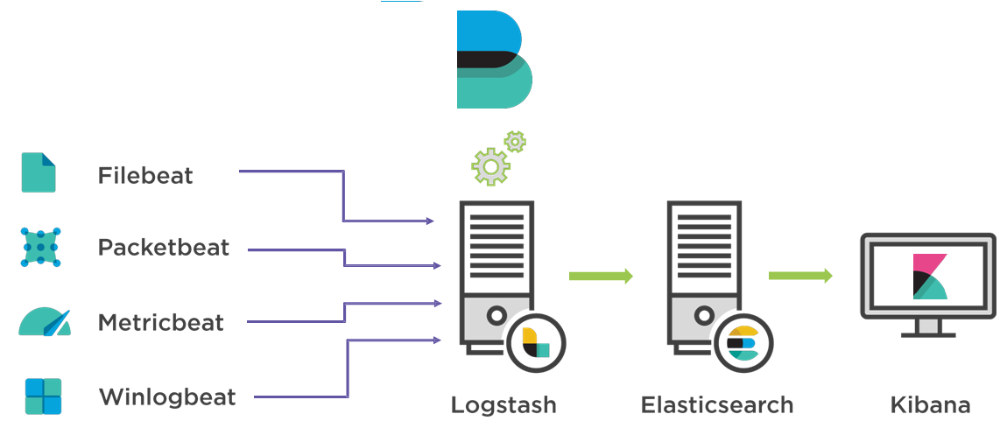

# ELK stack

## Elk stack là gì

- Elk stack cũng là một công cụ monitoring phổ biến, dùng để thu thập, xử lý, hiển thị dữ liệu trực quan

- ELK là viết tắt của 3 từ ElasticSearch, Logstash, Kibana
    - `ElasticSearch` là một hệ thống tìm kiếm và phân tích dữ liệu phân tán hay nói một cách dễ hiểu hơn nó là nơi để thực hiện những truy vấn từ dữ liệu mà bạn thu nhập được
    - `Logstash` là một công cụ thu thập dữ liệu với rất nhiều định dạng khác nhau và xử lý chúng để làm sao dữ liệu "sạch sẽ" hơn
    - `Kibana` là một giao diện web để giúp trực quan hoá dữ liệu từ elasticsearch dưới dạng các biểu đồ, bảng, và các thành phần khác như hình ảnh, văn bản hay nút điều khiển

    

- Logstash có thể lấy được những thông tin:
    - Logstash có thể trực tiếp được cấu hình thu nhập từ file (json, log, csv)
    - Logstash có thể thu nhập trực tiếp từ cơ sở dữ liệu
    - Logstash có thể thu thập từ những định dạng beat gửi đến

## Beat là gì

> Là công cụ để thu nhập dữ liệu

- Hiện tại đang có một số loại beat chính sau:
    - Filebeat: Filebeat là một beat được sử dụng để thu nhập và chuyển dữ liệu từ các tập tin log. Nó theo dõi các tập tin log và gửi các sự kiện log đến Logstash hoặc Elasticsearch để xử lý và lưu trữ.
    - Metricbeat: Metricbeat được sử dụng để thu thập thông tin về các chỉ số hệ thống và dịch vụ từ các máy chủ và hệ thống. Nó có thể thu thập các chỉ số CPU, bộ nhớ, tải hệ thống, thông tin về dịch vụ như MySQL, Apache và nhiều hơn nữa. Metricbeat gửi các dữ liệu thu thập được đến Logstash hoặc Elasticsearch để phân tích và hiển thị.
    - Packetbeat: Packetbeat là một Beat được sử dụng để thu thập thông tin về giao thức mạng từ dữ liệu gói tin. Nó có thể phân tích và hiểu được các giao thức như HTTP, DNS, ICMP, MySQL, PostgreSQL và nhiều giao thức khác. Packetbeat gửi dữ liệu thu thập được đến Logstash hoặc Elasticsearch để phân tích và xem xét chi tiết về hoạt động mạng.
    - Auditbeat: Auditbeat là một Beat được sử dụng để thu thập các sự kiện hệ thống và log kiểm tra an ninh từ các hệ điều hành Linux. Nó có thể thu thập thông tin về hoạt động hệ thống như các sự kiện đăng nhập, thay đổi quyền truy cập file, các sự kiện quản lý quyền truy cập và nhiều hơn nữa. Auditbeat gửi dữ liệu thu thập được đến Logstash hoặc Elasticsearch để phân tích và giám sát an ninh hệ thống.
    - Heartbeat: Heartbeat là một Beat được sử dụng để theo dõi sự hoạt động và sự sống còn của các dịch vụ và máy chủ. Nó có thể kiểm tra kết nối mạng, kiểm tra tính khả dụng của dịch vụ web và nhiều kiểm tra khác. Heartbeat gửi thông tin về trạng thái hoạt động đến Logstash hoặc Elasticsearch để giám sát và thông báo sự cố.

## Mô hình

