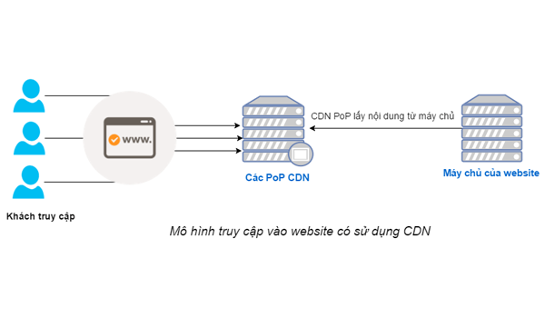

# CDN 

## CDN là gì

> CDN (Content Delivery Network) là mạng lưới phân phát nội dung (một hệ thống toàn cầu bao gồm nhiều máy chủ chứa những bản sao nội dung của website) nhằm cải tiến tốc độ nội dung truyền tải. CDN cũng được gọi là “distribution networks”. Ý tưởng là tạo được nhiều điểm truy cập (Point of Presence – PoPs) ngoài server gốc

- Hệ thống CDN được chia thành 2 phần chính:
  - Original Server: Đây là nơi đặt mã nguồn của website, chịu trách nhiệm chính xử lý dữ liệu (main website)
  - Hệ thống CDN: là những server được thiết lập để đặt biệt để làm nhiệm vụ lưu trữ dữ liệu website của bạn từ orginal server. Lúc này việc truy cập một website sẽ thông qua các server này thay vì trực tiếp trên server gốc. Server gốc lúc này chỉ có tác dụng kết nối mạng để đưa toàn bộ những file sang toàn các server con (được gọi là PoP – Points of Presence ) trong hệ thống CDN

## Sự khác nhau giữa một website không sử dụng CDN và một website sử dụng CDN:

- Website không sử dụng CDN: nếu người dùng xem một tập tin mà không có sự hỗ trợ của CDN, nghĩa là họ đã gửi một yêu cầu thẳng đến máy chủ có chứa website để truy cập tập tin đó.

- Website sử dụng CDN: nếu một tập tin được phân phối bởi CDN, khi người dùng truy cập vào tệp đó thì PoP sẽ trả nội dung về cho người dùng xem. Ví dụ nếu bạn ở Việt Nam thì PoP CDN ở Việt Nam sẽ phân phối nội dung cho bạn.

## Mục tiêu của CDN

- Tăng tốc độ tải trang: Thông qua việc phân phối nội dung từ các máy chủ gần người dùng, CDN giúp giảm thời gian tải nội dung trên trang web và cải thiện tốc độ trải nghiệm cho người dùng.
- Giảm độ trễ: CDN giảm thiểu độ trễ bằng cách đưa dữ liệu tới gần người dùng, giảm thiểu độ trễ khi truy cập tự mọi vị trí địa lý.
- Nâng cao hiệu năng: Do CDN cung cấp mạng lưới hạ tầng nhiều máy chủ phục vụ người dùng nên CDN giúp nâng cao hiệu năng, giảm nguy cơ quá tải cho máy chủ chứa nội dung gốc.
- Tăng cường bảo mật: CDN cung cấp bảo vệ nội dung khỏi các cuộc tấn công DDoS và cải thiện bảo mật thông qua nhiều cơ chế bảo vệ được tích hợp.
- Khả năng mở rộng không giới hạn: Với CDN, dịch vụ hỗ trợ khả năng mở rộng mạng lưới và cung cấp dịch vụ không giới hạn.
Nói ngắn gọn dễ hiểu hơn, CDN là một công nghệ quan trọng giúp cải thiện hiệu suất và trải nghiệm người dùng khi truy cập các nội dung trực tuyến trên mạng.

## Nguyên lý hoạt động của CDN

- **Lưu cache nội dung tại các máy chủ phân phối :**
Khi bạn sử dụng CDN, một phần nội dung trên trang web sẽ được lưu trữ tại hạ tầng máy chủ biên trên khắp thế giới và gần người dùng nhất. Các định dạng nội dung hỗ trợ đa dạng, phong phú bao gồm tài liệu, hình ảnh, video, tập tin CSS và JavaScript...
- **Caching**
CDN sử dụng cơ chế cache tạm thời để lưu trữ các bản sao của nội dung. Khi một người dùng truy cập trang web, nếu nội dung đã được lưu trữ trong cache, CDN sẽ cung cấp bản sao đã lưu thay vì phải lấy nội dung trực tiếp từ máy chủ gốc chứa nội dung. Với cơ chế caching này của CDN sẽ giảm thiểu đáng kể thời gian tải nội dung cho người dùng cuối.
- **Bảo mật**
CDN cung cấp các tính năng bảo mật nâng cao như cơ chế bảo vệ chống tấn công DDoS, mã hóa SSL/TLS và chứng chỉ SSL/TLS. Việc này giúp bảo vệ dữ liệu và cung cấp một môi trường an toàn cho người dùng.
  
Ngoài 3 nguyên lý chính kể trên, CDN còn điều hướng người dùng đến các máy chủ gần nhất, tối ưu, tăng tốc hóa hiệu suất cho website. Như vậy, sử dụng CDN giúp cải thiện tốc độ tải nội dung của trang web bằng cách giảm trễ và thời gian tải, tối ưu hóa hiệu suất cũng như tăng cường biện pháp bảo mật.

## Các câu hỏi thường gặp với CDN

### 1. CDN hoạt động như thế nào

- Về cốt lõi, CDN là mạng lưới các máy chủ liên kết với nhau với mục tiêu cung cấp nội dung nhanh, rẻ, đáng tin và an toàn. CDN sẽ đặt máy chủ tại các điểm trao đổi giữa các mạng với nhau. Các điểm trao đổi internet (IXP) là vị trí trung tâm nơi các nhà internet kết nối để cấp quyền truy cập vào trong mạng của mình cho những nhà internet khác
- CDN hoạt động theo các bước sau đây
  - B1(Lấy dữ liệu từ nguồn): CDN thu thập và lưu giữ các tài nguyên từ máy chủ gốc của trang web
  - B2(DNS Resolution): đầu tiên, khi client truy cập trang web, nó sẽ trả về DNS của CDN thay vì trả về DNS của server gốc
  - B3(Request tới CDN): người dùng tải tài nguyên muốn dùng từ CDN
  - B4(Phân phối nội dung): trả về nội dung nếu máy CDN có chứa tài nguyên người dùng cần, còn nếu k có thì sẽ lên server gốc để lấy
  - B5(Caching): lưu trữ các tài nguyên người dùng hay request đến phục vụ cho các lần request tiếp theo để tránh request tới máy chủ gốc liên tục (tốn tài nguyên, thời gian response lâu)