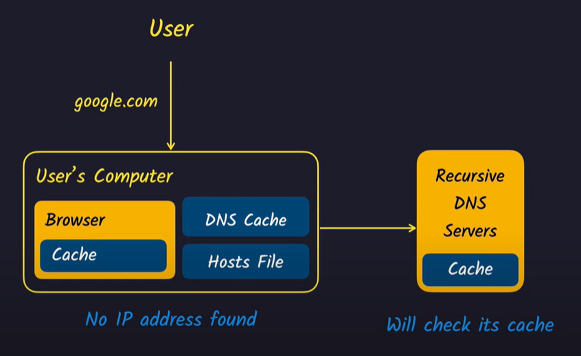
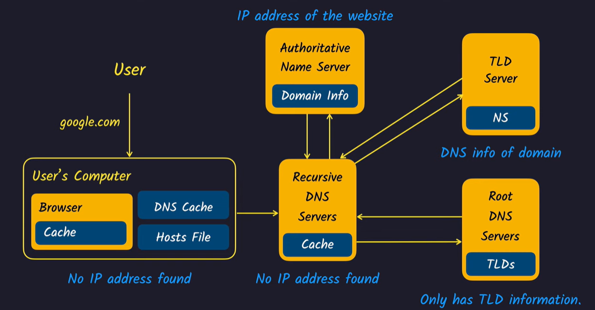
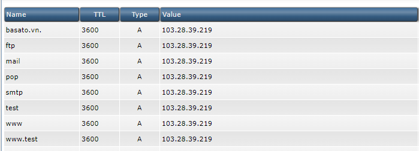

# DNS

[1.DNS là gì?](#whatisdns)

[2.Các loại dịch vụ DNS](#dnsservice)

[3.DNS hoạt động](#dnswork)

[4.DNS record](#dnsrecord)

# <a name="whatisdns">1. DNS là gì?</a>

```
DNS(Domain Name System) là hệ thống phân giải tên miền
```

- DNS là hệ thống phân giải các tên miền website thành các địa chỉ IP tương ứng. Ví dụ khi bạn nhập website cần truy cập, bạn sẽ không thể nhớ được chuỗi địa chỉ IP, thay vào đó bạn chỉ cần nhớ **domain name**, DNS sẽ phân giải tên miền đó thành IP và truy cập vào trang web đó
- DNS hoạt động như một quyển danh bạ điện thoại trong đó số điện thoại chính là địa chỉ IPAddress định danh riêng và domain name chính là tên định danh riêng với số điện thoại đó

# <a name="dnsservice">2. Các loại dịch vụ DNS</a>

- Authoritative DNS: là máy chủ DNS(DNS server) chịu trách nhiệm cung cấp câu trả lời cho recursive DNS khi recursive DNS gửi yêu cầu về địa chỉ IP đến authoritative DNS. Authoritative thực hiện 2 nhiệm vụ:
  - Lưu trữ danh sách các tên miền và địa chỉ IP trong các địa chỉ IP của nó
  - Phản hồi yêu cầu từ recursive DNS về địa chỉ IP chính xác được gán cho một tên miền. Sau khi nhận được câu trả lời, recursive DNS sẽ gửi thông tin đó trở lại máy tính(trình duyệt) đã yêu cầu nó và máy tính kết nối với địa chỉ IP


- Recursive DNS Resolver: là máy chủ DNS phản hồi truy vấn DNS và tìm kiếm máy chủ định danh hoặc kết quả DNS được lưu trữ trong cache cho tên miền được yêu cầu
  - Recursive nhận request từ website từ người dùng và kiểm tra các bản ghi (record) nhận được từ authoritive DNS (IP được trả về từ authoritive DNS)

# <a name="dnswork">3. DNS hoạt động như thế nào</a>


Đầu tiên khi người dùng nhập vào tên miền, bộ phận phân giải DNS sẽ tìm địa chỉ IP thông qua tên miền theo bước sau:

- Trước hết trình duyệt yêu cầu tìm IP tương ứng với tên miền tới máy chủ cục bộ (local name server - thường được duy trì bởi các doanh nghiệp, các nhà cung cấp dịch vụ internet)
- Nếu máy chủ cục bộ tìm kiếm không có dữ liệu thì nó sẽ tìm ở DNS cache (DNS cache của hệ điều hành có thể được lưu vào bộ nhớ đệm)
- Nếu DNS cache không có => tìm kiếm ở Host file


- Nếu thông quả cả 3 bước trên vẫn không tìm thấy được IP thì:

  - Recursive DNS server(Đệ quy DNS): là nhà cung cấp dịch vụ internet (ISP) của bạn
    - ISP có thể không biết gì về tên miền nhưng nó có thể thông qua các truy cập bất kỳ nào trước đó của người dùng nào đó đã từng truy cập website và có được địa chỉ IP của website đó

  
- Nếu thông qua Recursive DNS vẫn không lấy được IP => tìm ở Root DNS Server. DNS root server cũng không có thông tin địa chỉ IP của tên miền. Nhưng nó có thông tin của tên miền cao cấp hơn (TLP). (Ví dụ nếu bạn đang tìm địa chỉ **google.com** thì TLP sẽ là **.com** vì nó có tất cả thông tin của TLP server)

  - Hiện tại TLP server cũng không biết IP của tên miền là gì nhưng nó có thể trả về thông tin cuối cùng của máy chủ định danh có thẩm quyền (authoritative name server)
  - Từ máy chủ định danh này nó sẽ lấy được địa chỉ IP của tên miền => Trả về recursive DNS server => Chuyển về máy tính của người dùng => Tiếp đó đến trình duyệt => Trình duyệt gửi request về website server => Trả về thông tin website

  

# <a name="dnsrecord">4. DNS Record</a>

- Thông tin chính được lưu trữ ở authoritative name server được gọi là DNS hoặc zone files
- Các trường config DNS
  - **A** (A record): viết tắt của Address record. Khi cài đặt thông tin này ta gán địa chỉ IP của server mà tên miền này muốn trỏ đến
    

    - Type: kiểu config (A, CNAME,..)
    - Name: tên miền
    - Value: địa chỉ IP cần trỏ tên miền
    - TTL(Time to live): là khoảng thời gian máy khách sẽ lưu lại IP của tên miền trên bộ nhớ đệm
  - **CNAME** (Canonical Name): bản ghi cho phép chúng ta trỏ đến một tên miền hiện tại hoặc tên miền con. Ví dụ khi tìm kiếm **abc.com** nó sẽ trỏ đến tên miền **www.abc.com** và lấy địa chỉ IP truy cập website
  - **MXRecord** (Mail Exchanger): chỉ định server quản lý các dịch vụ email của tên miền đó. Cụ thể ta có thể trỏ tên miền đến mail server hay đặt mức độ ưu tiên thậm chí là TTL
  - **AAAA record**: giống với A record, khác biệt là AAAA record chính được sử dụng để trỏ domain đến 1 địa chỉ IPV6 Address. Tại đây ta có thể thêm host mới, IPV6, TTL
  - **DNS Record**: là DNS Server Records của tên miền, tại đây được chỉ định name server cho từng tên miền phụ. Ngoài ra còn có thể tạo host mới, tên name server hay TTL
  - **SRV record**: dùng để xác định chính xác dịch vụ nào, chạy port nào. Ngoài ra còn có thể bổ sung priority, name, port, point to, weight, TTL
