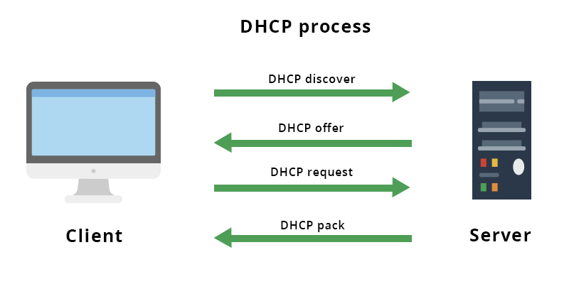
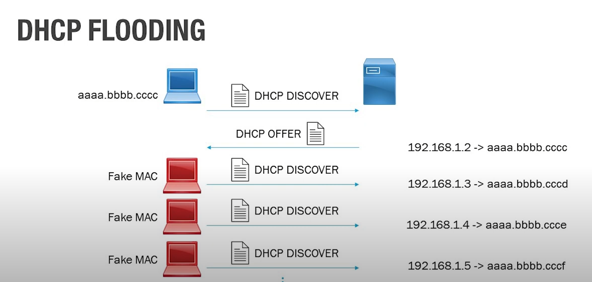
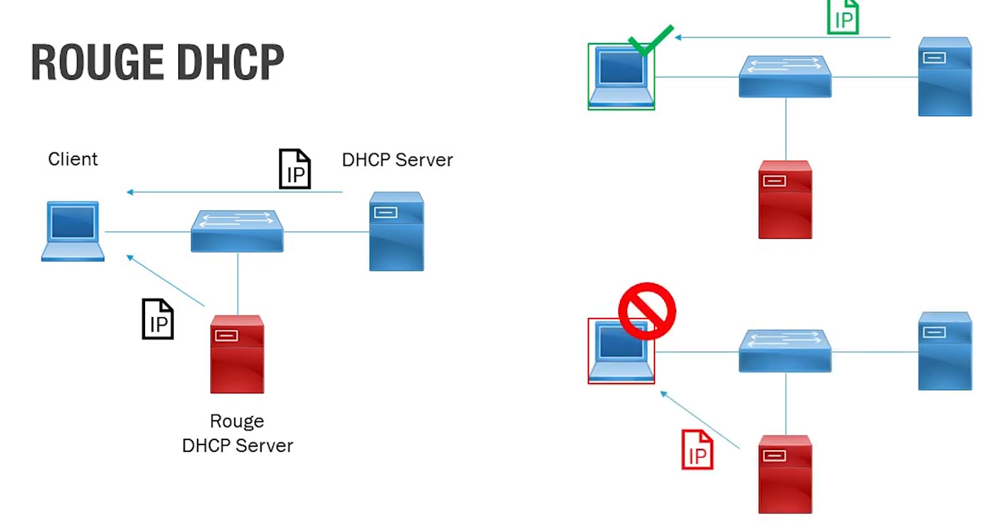

# DHCP - Dynamic Host Configuration Protocol

> Là giao thức tiêu chuẩn dùng để cấp IP cho thiết bị. Ngoài ra nó đảm bảo không có trường các thiết bị trong cùng một mạng được cấp IP giống nhau

## Phương thức hoạt động của DHCP

- DHCP hoạt động theo cơ chế *Client-Server*. Tức là cần một thiết bị đóng vai trò làm DHCP server (Thiết bị này sẽ quản lý và cung cấp IP cho các thiết bị trong mạng, thường các thiết bị làm DHCP server sẽ là router, switch, máy chủ, ..)

- Khi cấp phát IP thông qua DHCP Server, DHCP Server phải cùng một lớp mạng với client thì client mới có thể gửi gói tin *DHCP DISCOVER* được

- Các bước:
    - Đầu tiên khi client (các thiết bị mạng) bắt đầu kết nối, Client sẽ gửi gói tin *DHCP DISCOVER* để kiểm tra xem có DHCP server nào trong mạng hay không
    - Nếu có DHCP server trong mạng, client sẽ xin một địa chỉ IP chưa được sử dụng
    - Tiếp theo, máy chủ DHCP sẽ tìm địa chỉ IP khả dụng rồi cung cấp cho thiết bị. Thông tin IP sẽ được trả về thông qua gói *DHCP OFFER*
    - Sau khi nhận được địa chỉ, client sẽ phản hồi với máy chủ bằng một gói tin *DHCP REQUEST* yêu cầu sử dụng địa chỉ mạng IP này
    - Cuối cùng, máy chủ sẽ gửi tin báo nhận (ACK) xác nhận thiết bị đã được chấp thuận với IP và thời gian sử dụng IP đến khi có địa chỉ mới

## Nguy cơ có thể gặp của DHCP

#### 1. DHCP Flooding

Tưởng tượng đơn giản trường hợp như sau: 
- Ví dụ ta có 1 client khi bắt đầu kết nối sẽ gửi một gói tin *DHCP Discover* tới DHCP Server
- Sau đó, DHCP Server sẽ cấp phát 1 IP và trả về thông qua DHCP Offer
- Lúc này, client đó sẽ **FAKE MAC** và liên tục gửi lại gói tin DHCP DISCOVER tới cho DHCP Server 

=> Các IP sẽ được cấp tối đa và các client sau sẽ không còn IP để kết nối

#### 2. Rouge DHCP Server

Trường hợp như sau:
- Mạng của ta sẽ có 2 con DHCP server, 1 con do nhà quản trị cung cập, 1 con do có 1 người ngoài (bên t3) cố tình cắm vào
- Lúc này sẽ xảy ra trường hợp:
    - Khi client gửi gói tin DHCP Discover tới DHCP Server, sẽ có những trường hợp gửi đến *ROUGE DHCP Server*, và ta không thể được cấp IP để kết nối được với internet
    - Khi client gửi gói tin DHCP Discover tới DHCP Server, ROUGE DHCP Server sẽ cung cấp sai thông tin Default Gateway => Sẽ có nguy cơ bị nghe lén, và sau này các thông tin được gửi thông qua đường truyền mạng sẽ đều bị đánh cắp hết
    - Gửi sai thông tin DNS, lúc này nếu chúng ta tìm youtube.com thì nó sẽ điều hướng ta tới một trang web giả mạo => rất nguy hiẻm