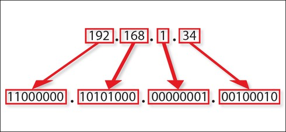
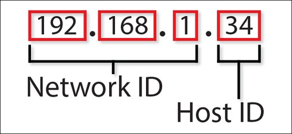
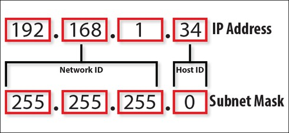

IP

# 1. Cơ bản về  IP

> IP (Internet Protocol) là địa chỉ số của thiết bị mạng để chia sẻ dữ liệu với nhau giao thức kết nối internet

# 2. Cấu trúc của IP

## a - IP

- Địa chỉ IPV4 thường được viết theo dạng gồm bốn nhóm số thập phân. Do 32 bit chia đều cho 4 nhóm số, nên mỗi nhóm sẽ gồm 8 bit dữ liệu (thường gọi là 1 oc-tet)

  
- Một địa chỉ IP bao gồm:

  - Network Id: xác định, phân loại các mạng với nhau. Ví dụ nếu địa chỉ IP là *192.168.1.34* - nghĩa là các thiệt bị mạng có cùng lớp 192.168.1 sẽ giao tiếp được với nhau. Các địa chỉ ngoài mạng sẽ không giao tiếp được đến các địa chỉ mạng trong đó
  - Host Id: dùng để xác định địa chỉ chính xác của thiết bị. Ví dụ với địa chỉ *192.168.1.34* thì host là 34 (Trong 1 mạng *192.168.1* thì sẽ có từ 1 đến 254 bộ Host Id, tương ứng với số thiết bị kết nối vào)
  - Trong thực tế, với một cụm mạng viettel ta sẽ có rất nhiều nhà sử dụng mạng (có thể coi mỗi nhà như một con đường) và trong con đường này thì sẽ có nhiều Host Id - chính là số nhà

## B - Subnet mask

- Subnet mask:
  - Mỗi địa chỉ IP đều đi kèm với thành phần là *Subnet mask*. Subnet mask sẽ được định nghĩa dựa theo lớp mạng của địa chỉ IP. Ví dụ, với IP 192.168.1.3 => Class mạng của IP là 3, NetworkId = 192.168.1 và HostId = 3 => Subnet mask sẽ là số bit của NetworkId và thay hoàn toàn bằng bit 1

## C - Default Gateway

- Với giao thực TCP/IP, các mạng có cùng network có thể giao tiếp với nhau. Nhưng trong trường hợp 2 địa chỉ IP có NetworkId khá nhau, muốn gửi thông tin cho nhau thì phải đi xuyên qua thiết bị Router, bằng cách gửi một cổng thoát mặc định, Default gateway là địa chỉ của router đó
- Trong mạng máy tính gia đình, các địa chỉ máy con thường là 192.168.1.2, 192.168.1.3,... khi muốn gửi nhận thông tin ra ngoài Internet thì phải gửi ra địa chỉ *Default gateway* - 192.168.1.1. Địa chỉ 192.168.1.1 này phải được cài đặt trên router.

# 3. Ví dụ cơ bản thực tiễn về IP

Ví dụ 1: Xác định lớp mạng

| 10.250.1.1  | (Thuộc lớp mạng A vì số 10 thuộc dải của class A) |
| ------------- | ----------------------------------------------------------- |
| 150.10.15.0 | (Thuộc lớp mạng B vì 150 thuộc dải class B)         |

Ví dụ 2: Khoanh vùng lớp mạng

| 177.100.18.4  | Sẽ khoanh tròn lớp mạng là 177.100 do 177 là dải mạng class B => Khoanh 2 phần    |
| --------------- | -------------------------------------------------------------------------------------------- |
| 119.18.45.0   | Sẽ khoanh tròn lớp mạng là 119 do 119 là dải mạng class A => Khoanh 1 phần        |
| 209.240.80.78 | Sẽ khoanh tròn lớp mạng là 209.240.80 do 209 là dải mạng class C => Khoanh 3 phần |

Ví dụ 3: Khoanh tròn subnet: sẽ là phần còn lại ngoại trừ lớp mạng

| 10.15.123.50   | Sẽ khoanh tròn lớp subnet là 15.123.50 do 10 là dải mạng class A => Khoanh 3 phần |
| ---------------- | ------------------------------------------------------------------------------------------- |
| 171.2.199.31   | Sẽ khoanh tròn lớp subnet là 199.31 do 171 là dải mạng class B => Khoanh 2 phần   |
| 198.125.87.177 | Sẽ khoanh tròn lớp subnet là 177 do 198 là dải mạng class C => Khoanh 1 phần      |

Ví dụ 4: Sử dụng địa chỉ IP và Subnet Mask để viết ra địa chỉ IP

| IP          | Subnet mask   | IP con     | Giải thích                                                                                                                                    |
| ------------- | --------------- | ------------ | ------------------------------------------------------------------------------------------------------------------------------------------------- |
| 188.10.18.2 | 255.255.0.0   | 188.10.0.0 | Vì ta sẽ cắt dải subnet mask không chứa số 255 => cắt 255.255.0.0 thành 2 cụm 255.255 và 0.0 => ghép vào được IP 188.10.0.0     |
| 10.10.48.80 | 255.255.255.0 | 10.10.48.0 | Vì ta sẽ cắt dải subnet mask không chứa số 255 => cắt 255.255.255.0 thành 2 cụm 255.255.255 và 0 => ghép vào được IP 10.10.48.0 |

Ví dụ 5: Sử dụng địa chỉ IP và Subnet mask để viết ra địa chỉ Host

| IP          | Subnet Mask   | IP con   | Giải thích                                                                                                                                   |
| ------------- | --------------- | ---------- | ------------------------------------------------------------------------------------------------------------------------------------------------ |
| 188.10.18.2 | 255.255.0.0   | 0.0.18.2 | Ta cắt subnet mask thành 2 phần lấy 0.0, tương ứng cắt IP thành 2 phần và lấy phần 18.2 => Ghép subnet mask + IP thành 0.0.18.2 |
| 10.10.48.80 | 255.255.255.0 | 0.0.0.80 | Ta cắt subnet mask thành 2 phần lấy 0, tương ứng cắt IP thành 2 phần và lấy phần 80 => Ghép subnet mask + IP thành 0.0.0.80     |
