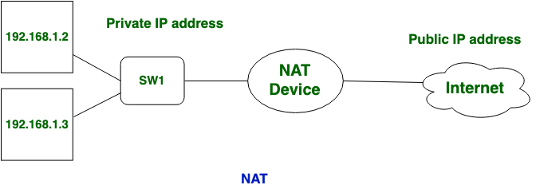

# NAT (Network Address Translation)

## NAT là gì

> NAT hiểu đơn giản là công cụ giúp biên dịch địa chỉ Private IP hay địa chỉ mạng local thành địa chỉ mạng IP Public để kết nối được với internet

Ví dụ: Mạng gia đình có 3 thiết bị máy tính, điện thoại và TV. Khi không sử dụng NAT, mỗi một thiết bị đều sẽ phải được cấp 1 public IP để kết nối tới internet. Tuy nhiên với NAT, tất cả các thiết bị này sẽ có thể dùng chung chỉ một public IP và kết nối tới internet bằng cách sử dụng chính private IP của từng máy. Khi một máy gửi request tới internet, NAT sẽ biên dịch địa chỉ IP Private của thiết bị thành địa chỉ IP Public của network và gửi request tới

## NAT Port 

> NAT Port cho phép dữ liệu đi qua thiết bị mạng như modem, router, switch,.. mà không bị ngăn chặn bởi tường lửa nhằm đảm báo tốc độ download

- Port - Là cổng giao tiếp giữa các thiết bị để truyền và nhận các gói dữ liệu
- Port Fowarding: là quá trình chuyển tiếp 1 port cụ thể từ mạng này đến mạng khác, cho phép người dùng bên ngoài có thể truy cập vào mạng bên trong bằng cách sử dụng port đó từ bên ngoài thông qua bộ định tuyến (đã mở NAT)
- Các port được giới hạn từ 0-65535 và bình thường tất cả các port này sẽ đóng

## Vậy làm sao để người bên ngoài có thể truy cập vào được Server

- Để truy cập vào được dịch vụ của Server, ta phải dùng Port Forwarding, PortMapping (hay gọi chung là mở port)