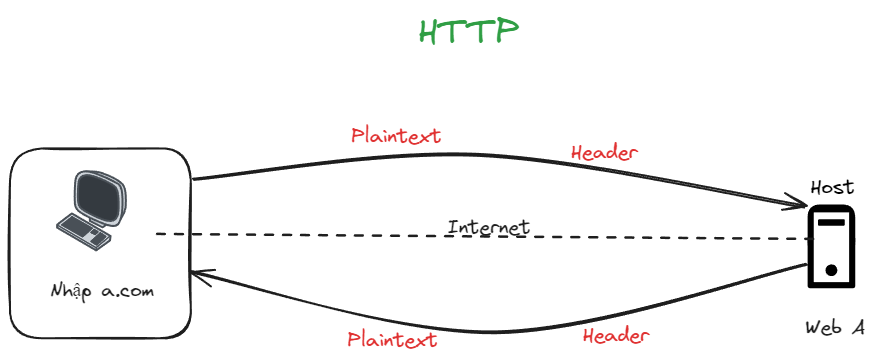
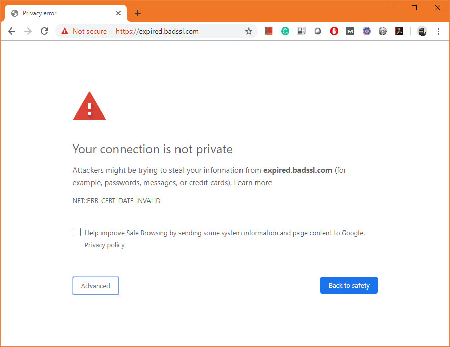

# Cơ bản về HTTP và HTTPS

1. Http là gì

   > Http (Hypertext Transfer Protocol) là một giao thức truyền tin giữa máy chủ web và trình duyệt web thông qua internet
   >

   - Tưởng tượng hiện nay khi giao tiếp với từ các PC (Client) tới các máy chủ, ta cần phải có 1 chuẩn riêng để giao tiếp và đó chính là giao thức HTTP. Khi bạn gõ 1 địa chỉ vào trình duyệt web, lúc này trình duyệt web sẽ gửi 1 yêu cầu qua giao thức HTTP đến Web server. Web server nhận yêu cầu và trả lại kết quả cho trình duyệt web
   - Điểm yếu của giao thức chuẩn này là dữ liệu được gửi giữa client và server sẽ hoàn toàn không được mã hoá (gửi dữ liệu dưới dạng **Plaintex**) => Vì vậy, 1 người dùng bất kì có thể xen vào giữa lúc truyền thông tin dữ liệu giữa client và server để đánh cắp thông tin
2. Https là gì

Vì lí do bảo mật của HTTP, HTTPS được sinh ra nhằm khắc phục điều đó

> Https (HyperText Transfer Protocol Secure) là giao thức có sử dụng thêm SSL - Secure Sockets Layer (hoặc TSL) để mã hoá dữ liệu trong lúc truyền tải dữ liệu nhằm gia tăng tính an toàn cho việc truyền dữ liệu giữa client và web server

- Giao thức HTTPS sử dụng port 433 để truyền dữ liệu
- Ngoài việc mã hoá dự liệu truyền đi và gửi về, nó còn có thêm chức năng xác thực trang web. Ví dụ khi bạn nhập thông tin vào trang web ngân hàng giả mạo đã bị clonet lại y hệt, thì HTTPS sẽ sử dụng PKI (**Public key infrastructure**). Khi đó bên thứ 3 (Cert Authority) sẽ kiểm tra trang web đó đã được đăng kí Certificate (chứng nhận là trang web này đã được xác thực)

